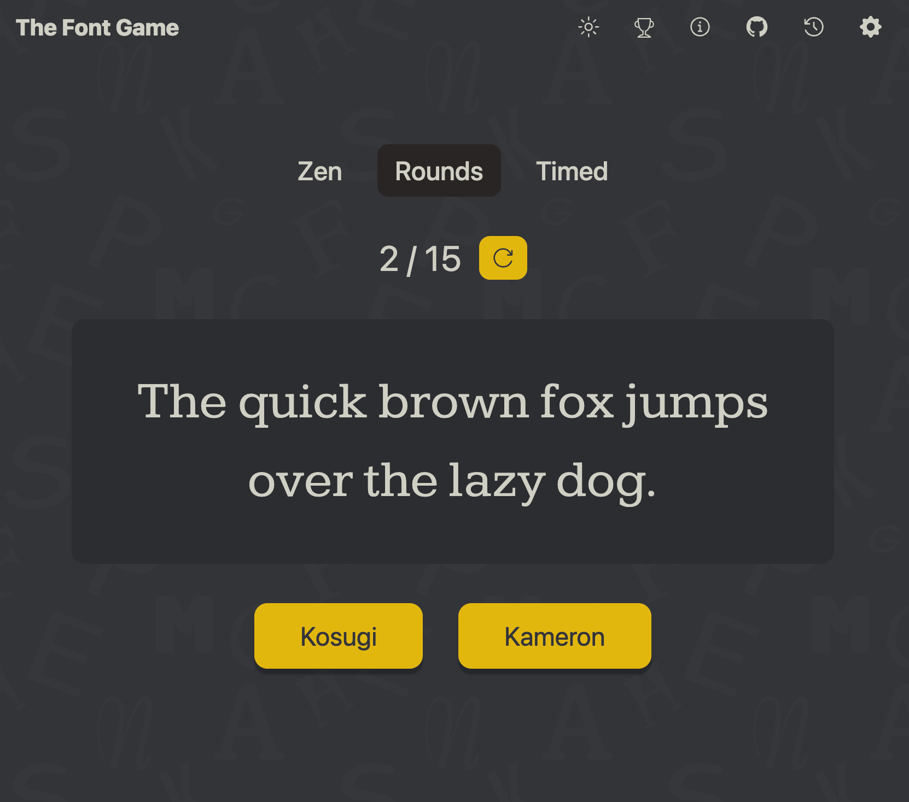

# Font Game
In this game a user gets to see the name of a font in a showcase, and guess from a range of possible options what they think this font is named.


## Features
- Three game modes
  - Zen - Player just picks answers, no score, infinitely
  - Rounds - Player plays 15 rounds of questions
  - Timed - Player plays for 30 seconds and gains/loses 1 second depending if they got the answer correct or not
- Players can set their own game options for:
  - Number of answer options
  - Show/Hide Auxiliary keywords in font names (sans, mono, serif etc...)
  - Which phrases to use in the font showcase
- Light / Dark Mode
- Font history page where player can see all the previous fonts they've seen
- Stats Page where player can see various game related stats, including their own high scores, how many distinct fonts they've seen and how many answers they gave in total

## Updating the fonts available in game

The fonts are fetched through a file in the googlefonts github repo, this list is then filtered through various criteria.
The list of available fonts is compiled ad-hoc, by running the `update-fonts.js` script, and they get stored in the `assets/fonts.json` file.

To run the script: `npm run updatefonts`


### dev notes

For some reason intellisense relying on nuxt imports is only enabled once the `.nuxt/eslint.config.mjs` is open at least once, and needs to be opened at least once everytime the project is opened on vscode. Not sure how to fix this


### This project depends on a few hard coded things:

If they change the app would break:

- The existance of this file, and it's structure https://raw.githubusercontent.com/google/fonts/main/tags/all/families.csv
- Google fonts base url: https://fonts.googleapis.com/css2?family=

## Setup

Make sure to install the dependencies:

```bash
# npm
npm install

```

## Development Server

Start the development server on `http://localhost:3000`:

```bash
# npm
npm run dev

```

## Production

Build the application for production:

```bash
# npm
npm run build
```

Locally preview production build:

```bash
# npm
npm run preview
```

Check out the [deployment documentation](https://nuxt.com/docs/getting-started/deployment) for more information.
